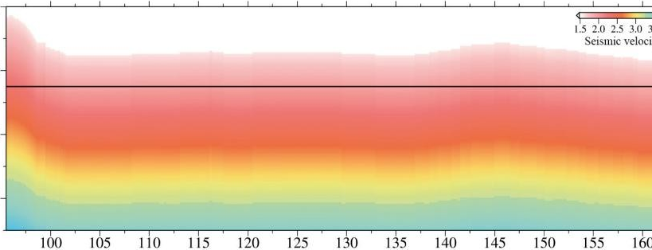
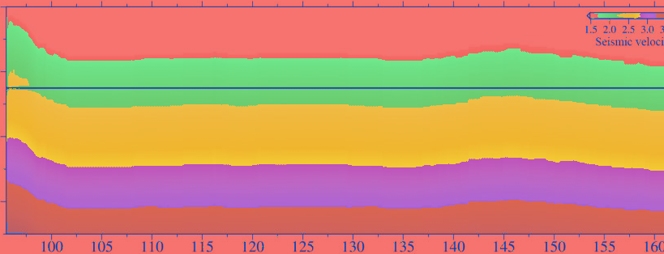
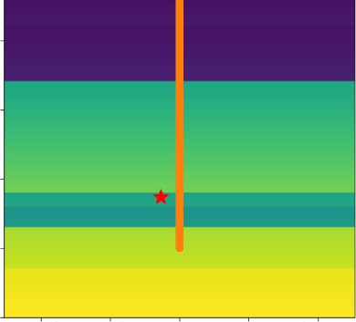
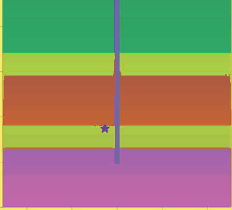
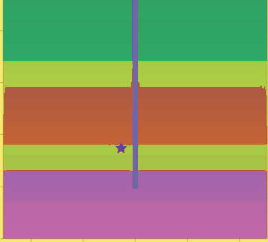
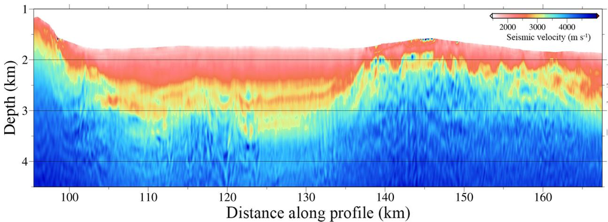
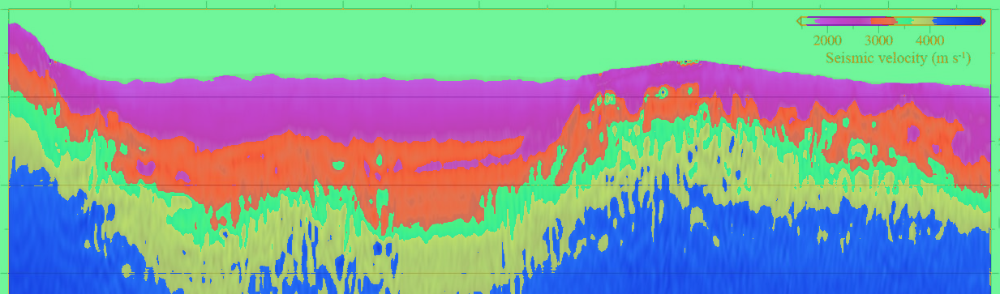
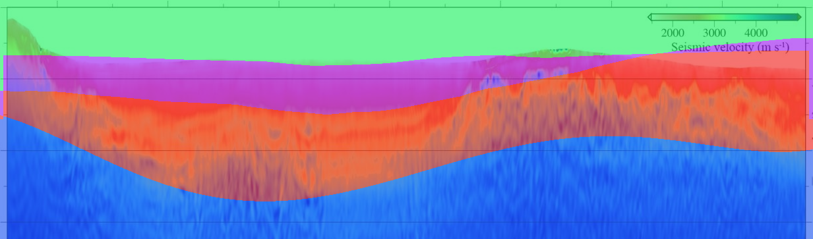

# geoseg v2

> Agent-native velocity zone extraction from geophysics interpretation figures.

**geoseg** converts published geophysics figures — colored cross-sections, tomography maps, MATLAB-rendered seismic profiles — into [SPECFEM](https://github.com/SPECFEM/specfem2d)-ready velocity zone models. The entire pipeline is driven by AI agents inside [Claude Code](https://claude.ai/code), not by a traditional GUI.

## Why

Traditional segmentation tools require manual tracing, parameter tuning, and domain expertise. We asked: **what if the entire pipeline could be driven by an agent that sees what we see, decides what to do, and asks for help only when it needs it?**

geoseg v2 is the answer: a CLI-native workflow where agents autonomously classify figures, detect panels, select segmentation engines, and iterate on results — with humans in the loop only at the overlay review stage.

## Key Features

- **Agent-Native Architecture** — No traditional GUI. The entire pipeline is orchestrated by Claude Code skills (`geo-segment`, `batch-segment`, `sandbox-segment`, `figure-classify`).
- **CLI Human-in-the-Loop** — Agent auto-runs the pipeline, presents overlay results, and waits for natural language feedback. "Remove the colorbar" or "Split the bottom layer" — the agent re-runs sandbox on the fly.
- **Multi-Engine Segmentation** — `sandbox-segment` autonomously tries multiple engines (k-means, edge-guided, ensemble, grayscale) and picks the best via VLM visual evaluation + objective metrics.
- **Horizon Refinement** — Post-processes fragmented segmentations by fitting smooth curves to layer boundaries, eliminating "broken glass" artifacts without sacrificing boundary sharpness.
- **Strategy Memory** — Learns from past segmentations. After each batch, extracts strategy templates (e.g. *"vivid + high edge → ensemble"*) and improves future decisions.
- **Session State Persistence** — Full lifecycle tracking (`pending → classified → segmented → reviewed → exported`) with backtracking to any upstream stage.
- **Batch Processing** — Process entire directories with parallel agents (≤5 concurrent), then review all results in one pass.
- **HTML Report Dashboard** — Auto-generates a beautiful dashboard with figure cards, overlay comparison, and a real-time feedback chatbox (via optional rmux bridge to CLI).

## Architecture

```
PDF / Image
    ↓
[figure-classify] → velocity_model / skip
    ↓
[cv_detect] → panels + colorbar extraction
    ↓
[sandbox-segment] → best labels (agent picks engine, evaluates, fuses)
    ↓
[Human Review] → overlay confirmed / modified via natural language
    ↓
[post_process] → polygons + properties + SPECFEM export
```

All VLM reasoning happens inside Claude Code agent sessions via the `Read` tool. No Python subprocess calls to `claude -p`.

## Quick Start

### Prerequisites

- Python 3.10+
- [Claude Code](https://claude.ai/code) CLI
- [rmux](https://github.com/joshmedeski/rmux) (optional, for real-time frontend → CLI feedback)

### Install

```bash
git clone https://github.com/daiduo2/geoseg.git
cd geoseg

python3 -m venv .venv
source .venv/bin/activate
pip install -r requirements.txt
```

### Single Figure

In Claude Code:
```
User: /geo-segment runs/M0.5/fig1.png --n-layers=5

Agent: [auto-runs classify → detect → segment]
       📊 fig1.png  分割完成
          类型: velocity_model (0.92)
          引擎: kmeans_full → 5 层
          质量: 0.85
       [shows overlay]

       Accept / Modify / Skip / Backtrack ?

User: 修改。去掉右上角颜色条，底层分两层。

Agent: [re-segments with mask + n_layers+1]
       [shows new overlay]
       Accept / Modify / Skip / Backtrack ?

User: 接受

Agent: [exports SPECFEM]
       ✅ tomo.xyz + Par_file_snippet.txt
```

### Batch Processing

```
User: /batch-segment runs/M0.5/ --n-layers=5

Agent: [Stage 1-3: scans → classifies all → segments all]
       📦 5 张目标图已处理完毕，请 review。

       [1] fig1.png  ✅ 0.85  5层
       [2] fig3.png  ✅ 0.91  4层
       [3] fig4.png  ⚠️  0.62  3层  ← 建议修改
       [4] fig7.png  ✅ 0.78  6层
       [5] fig9.png  ⚠️  0.58  2层  ← 建议修改

User: 1,2,4 接受；3 修改：底层应分两层；5 跳过

Agent: [exports 1,2,4; re-segments 3; skips 5]
```

### Generate Report

```bash
# After batch processing, generate an HTML dashboard
python3 -m geoseg.generate_report runs/sessions/batch_xxx.json
open runs/reports/batch_xxx.html
```

For real-time feedback from the browser chatbox to the CLI session:

```bash
# Terminal 1: start Claude Code inside a named rmux session
rmux new-session -s geoseg
# (inside rmux) cd /path/to/geoseg && cc

# Terminal 2: start the feedback bridge
python3 -m geoseg.feedback_bridge --rmux-session=geoseg

# Now type feedback in the HTML report chatbox — it appears directly in the CLI session
```

## Examples

### Original vs. Segmentation Overlay

<table>
  <tr>
    <td align="center" width="33%">
      
      <br/><sub>Original: velocity cross-section (Gras et al., 2019)</sub>
    </td>
    <td align="center" width="33%">
      
      <br/><sub>Coarse: kmeans_full, 4 layers</sub>
    </td>
    <td align="center" width="33%">
      
      <br/><sub>Refined: horizon refinement (fallback — already clean)</sub>
    </td>
  </tr>
  <tr>
    <td align="center" width="33%">
      
      <br/><sub>Original: Vp model with wellbore (Silixa 2021)</sub>
    </td>
    <td align="center" width="33%">
      
      <br/><sub>Coarse: kmeans_full, 4 layers</sub>
    </td>
    <td align="center" width="33%">
      
      <br/><sub>Refined: horizon refinement (fallback — already clean)</sub>
    </td>
  </tr>
  <tr>
    <td align="center" width="33%">
      
      <br/><sub>Original: seismic tomography (Gras et al., 2019)</sub>
    </td>
    <td align="center" width="33%">
      
      <br/><sub>Coarse: kmeans_full, 4 layers — severe fragmentation</sub>
    </td>
    <td align="center" width="33%">
      
      <br/><sub>Refined: curvature-constrained repartitioning, frag 0.0294 → 0.0004</sub>
    </td>
  </tr>
</table>

> **Note:** All overlays use vivid, perceptually distinct colors (golden-ratio HSV palette) at high opacity (α=0.65) so both VLM and human reviewers can clearly distinguish every segmented region. Three fill modes are available: `blend` (default, shown above), `solid` (near-opaque), and `mask` (pure segmentation map). The human-in-the-loop review step allows natural language feedback (e.g. "split the bottom layer" or "remove the colorbar") for on-the-fly refinement.
>
> **Horizon Refinement** (v0.8 Direction A): When pixel-wise clustering produces fragmented boundaries ("broken glass" effect), the agent detects whether layers actually touch. For touching layer pairs, it fits smooth curves via Savitzky-Golay with `mode='mirror'` and adjusts only boundary-adjacent pixels. For severely fragmented (non-touching) layer pairs — "archipelagos" of disconnected fragments — it switches to curvature-constrained quintic splines (minimizing |y'''|²) and performs global column-wise repartitioning, redrawing all maritime borders simultaneously. If the coarse segmentation is already clean or lacks spatial coherence, the refinement step gracefully falls back to the original result.

## Project Structure

```
geoseg/
├── modules/
│   ├── cv_detect/              # Panel detection, colorbar extraction
│   ├── segment_engines/        # Multi-engine segmentation + strategy memory
│   │   ├── v4_kmeans.py
│   │   ├── edge_guided.py
│   │   ├── ensemble.py
│   │   ├── grayscale.py
│   │   ├── strategy_memory.py  # History-based engine selection
│   │   └── metrics.py          # Objective facts (no physical bias)
│   ├── vlm_client/             # Schema + prompt definitions (pydantic)
│   │   ├── prompts.py          # Single source of truth for schemas
│   │   └── client.py           # DEPRECATED (agent-native only)
│   ├── post_process/           # Polygon extraction, property assignment
│   └── exporter/               # SPECFEM tomography_file + Par_file
├── session_state.py            # Persistent session state with backtracking
├── generate_report.py          # HTML dashboard generator
├── feedback_bridge.py          # Browser → rmux → CLI real-time bridge
├── pipeline_interfaces.py      # Inter-module contracts (TypedDict + Protocol)
├── controller.py               # Pipeline orchestration
└── batch_processor.py          # Batch processing wrapper

.claude/skills/
├── geo-segment/                # End-to-end single figure skill
├── batch-segment/              # Batch processing skill (5-stage pipeline)
├── sandbox-segment/            # Autonomous segmentation skill
└── figure-classify/            # Figure classification skill
```

## Design Philosophy

1. **Agent-Native over GUI** — The interaction model is conversation, not clicks. Natural language is the interface.
2. **Human-in-the-Loop at Review Only** — Auto-run everything, stop only for overlay confirmation. No manual tracing.
3. **Upstream Backtracking** — Users can backtrack to `classify`, `panel`, or `segment` stage from review. Natural language feedback drives re-execution.
4. **Conservative Classification** — Prefer false negatives over false positives. Skip non-velocity-model figures immediately.
5. **VLM Judgment Primary** — Visual evaluation by the agent trumps quantitative metrics. Geological sense > mathematical smoothness.
6. **Immutable State** — Session state updates return new objects. Every significant step is persisted to JSON.

## History

- **v0.1–v0.6** — PySide6 GUI + manual pipeline. Reached functional completeness but GUI interaction felt unnatural.
- **v0.7** — Tauri + FastAPI frontend designed, but abandoned before implementation. Realized the project's value is the *agent-driven workflow*, not another GUI tool.
- **v0.8** — CLI-native HITL with session state persistence, upstream backtracking, and HTML report dashboard.

## License

MIT
