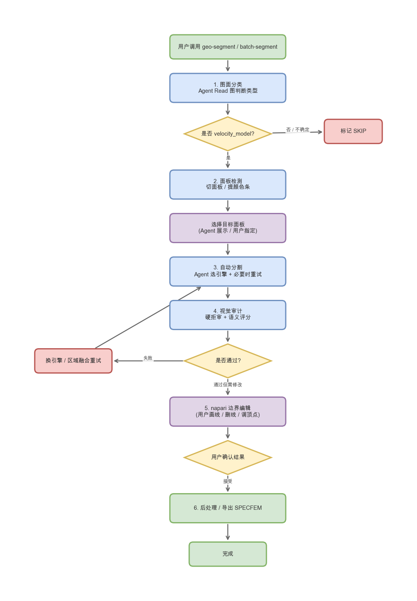
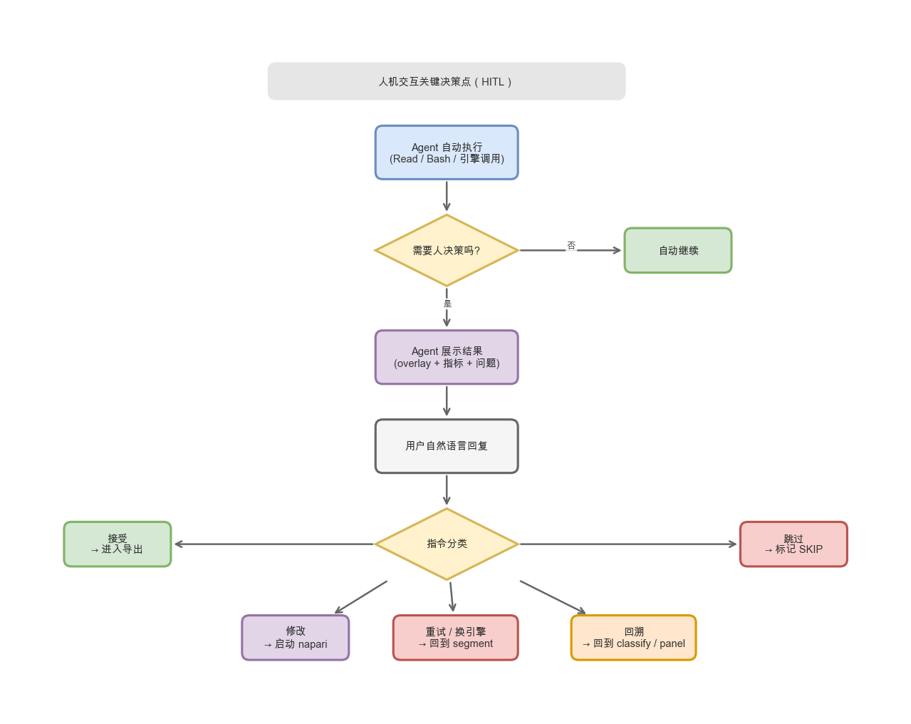
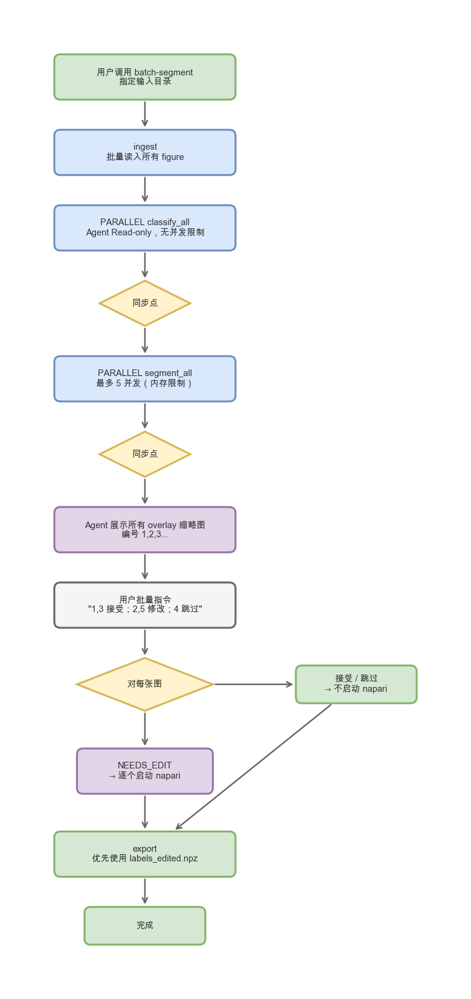
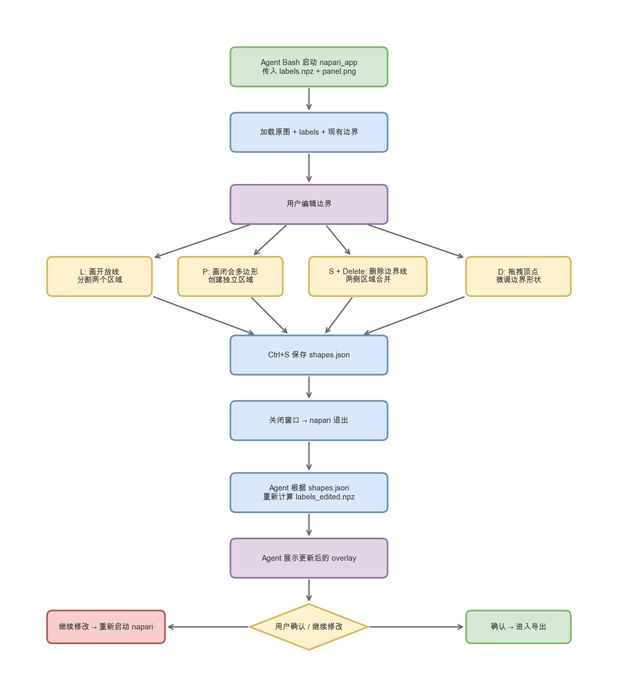
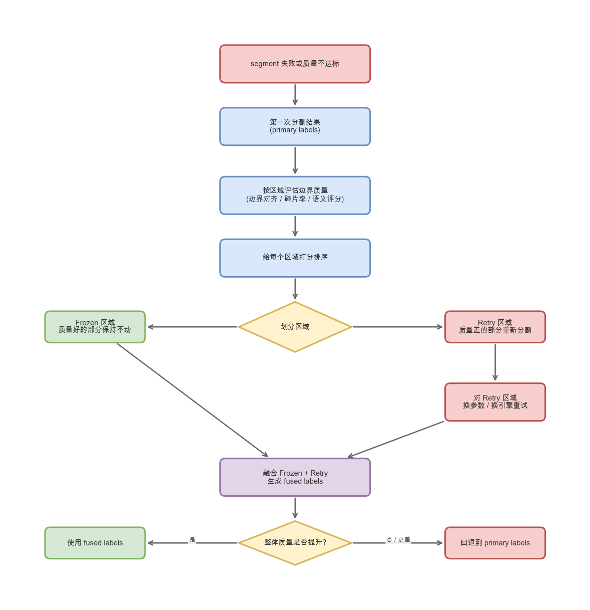
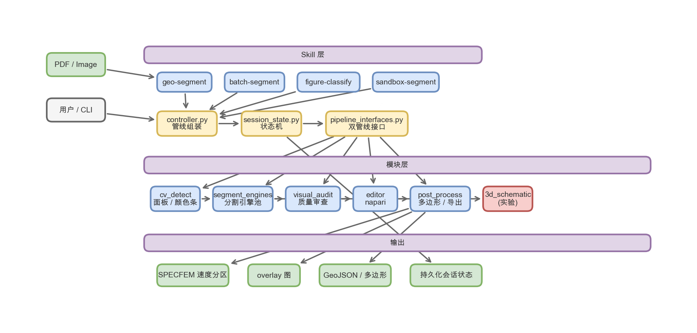

# geoseg v2 项目状态总览

> 审计日期：2026-06-19  
> 代码库路径：/Users/daiduo2/geoseg  
> 分支：feat/regional-fusion

---

## 1. 项目一句话

geoseg v2 是一个**从地球物理解释图里自动提取速度分区概念模型**的 CLI 工具链。输入是论文中的图片/PDF，输出是 SPECFEM 可用的速度分区文件。整个过程由 Claude Code Agent 驱动，人在关键节点（分类判断、边界修正）进行干预。

**核心原则：** 只做概念模型提取，不做正演、不做反演、不做波形模拟。

---

## 2. 流程图索引

源文件保存在 `docs/assets/flowcharts/`，可用 draw.io / diagrams.net 打开；PNG 预览在 `docs/assets/flowcharts/previews/`。

| 流程图 | 源文件 | 说明 |
|--------|--------|------|
| 项目架构 | `project_architecture.drawio` | Skill / Controller / Module / Output 分层 |
| 整体 Pipeline | `pipeline_overall.drawio` | 单图从输入到导出的完整流程 |
| 人机交互决策点 | `hitl_interaction.drawio` | Agent 何时暂停、用户有哪些指令分支 |
| 批量处理流程 | `batch_workflow.drawio` | 并行分类/分割 + 批量对话筛选 + 按需 napari |
| napari 边界编辑 | `napari_editor.drawio` | 启动编辑器到重新计算 labels 的闭环 |
| 区域融合重试 | `regional_fusion.drawio` | 冻结好区域、重试差区域、融合回退逻辑 |

### 2.1 整体 Pipeline



### 2.2 人机交互决策点



### 2.3 批量处理流程



### 2.4 napari 边界编辑



### 2.5 区域融合重试



### 2.6 项目架构



### 2.7 PPT 专用版（按幻灯片占位符重新排版）

为 `/Users/daiduo2/Downloads/geoseg v2 项目状态总览.pptx` 中的留空区域单独制作了匹配比例的 drawio 源文件和 PNG 预览，方便直接贴入 PPT。

| PPT 占位位置 | 尺寸（宽×高 in） | 内容 | drawio 源文件 | PNG 预览 |
|---|---|---|---|---|
| Slide 4 | 8.06 × 6.53 | 项目架构分层 | `ppt/project_architecture_slide4.drawio` | `ppt/previews/project_architecture_slide4.png` |
| Slide 6 | 16.67 × 3.61 | 整体 Pipeline（横向宽版） | `ppt/pipeline_overall_slide6.drawio` | `ppt/previews/pipeline_overall_slide6.png` |
| Slide 7 | 8.06 × 7.92 | 人机交互泳道图 | `ppt/hitl_interaction_slide7.drawio` | `ppt/previews/hitl_interaction_slide7.png` |
| Slide 8 | 7.50 × 6.11 | 模块关系/接口视图 | `ppt/module_relations_slide8.drawio` | `ppt/previews/module_relations_slide8.png` |
| Slide 11 | 8.06 × 7.92 | 区域融合 Retry 循环 | `ppt/regional_fusion_slide11.drawio` | `ppt/previews/regional_fusion_slide11.png` |

所有 PPT 专用源文件和预览保存在 `docs/assets/flowcharts/ppt/`。drawio 文件可用 diagrams.net / draw.io 直接打开并进一步微调。

---

## 3. 整条 Pipeline：从图片到速度模型

可以把 pipeline 理解成一条 5 道工序的流水线：

```
PDF / 图片
    ↓
[1. 图面分类]  → 判断这张图是否值得处理（速度模型？观测数据？无关？）
    ↓
[2. 面板检测]  → 把图里的有效面板切出来，去掉颜色条、坐标轴等干扰
    ↓
[3. 自动分割]  → 把面板里的地质层/速度分区分开
    ↓
[4. 质量审查]  → agent 视觉批评 + RegionalAudit，Frozen/Retry 驱动修复
    ↓
[5. 后处理/导出] → 提取多边形、赋值速度、导出 SPECFEM
```

### 3.1 人机交互模型

不是全自动化，而是 **Agent 主导 + 人在关键处把关**。整个流程从 Claude Code 对话中触发，Agent 用 Read 读图、用 Bash 调工具，人在关键节点给出自然语言指令。

#### 触发方式

- 用户在对话中调用 skill：`geo-segment`（单图）、`batch-segment`（批量）、`figure-classify`（仅分类）、`sandbox-segment`（自主分割）。
- Agent 根据当前会话状态继续执行，或从上次断点恢复。

#### 单图流程中的人机交互

```
用户触发 geo-segment
    ↓
Agent 展示分类结果，必要时询问 "这张图是 velocity_model 吗？"
    ↓
Agent 展示切出的面板，必要时让用户选择目标面板
    ↓
Agent 展示分割 overlay，等待用户反馈
    ↓
用户指令：接受 / 修改 / 重跑 / 跳过
    ↓
若修改 → 启动 napari 编辑器（阻塞式 GUI）
    ↓
用户关闭 napari → Agent 自动重新计算 labels → 展示更新结果
    ↓
用户确认 → 导出 SPECFEM
```

**已实现的交互逻辑：**

1. **分类确认**  
   Agent 用视觉判断图片类型。若置信度不足或遇到边缘类型（如 survey geometry），会把分类理由和结论展示给用户，等待确认或纠正。宁可误拒也不误放 observational_data。

2. **面板选择**  
   当一张图里有多个面板时，Agent 会先检测所有候选面板并编号展示。用户可以用自然语言指定目标，例如 "处理 panel 2" 或 "跳过第一个"，Agent 据此过滤非目标面板。

3. **分割结果审查**  
   Agent 把 overlay（原图 + 分割边界）展示在对话中，给出层数、碎片率、语义评分等关键指标。用户可回复：
   - `"接受"` / `"ok"` / `"这一张过"` → 进入导出；
   - `"修改"` / `"边界太粗糙"` / `"这里少分了一层"` → 启动 napari；
   - `"重跑"` / `"换引擎试试"` → Agent 换策略重新分割；
   - `"跳过"` / `"这张不要"` → 标记为跳过，不进入后续阶段。

4. **napari 边界编辑（阻塞式 GUI）**  
   对需要修改的图，Agent Bash 启动 napari 编辑器并阻塞等待：
   - 用户用 `L` 画开放线分割区域；
   - 用 `P` 画闭合多边形创建独立区域；
   - 用 `S` 选中 + `Delete` 删除边界线，两侧区域自动合并；
   - 用 `D` 拖拽顶点微调边界；
   - `Ctrl+S` 保存 shapes，关闭窗口后自动重新计算 `labels_edited.npz`。
   Agent 在窗口关闭后继续执行，展示更新后的 overlay 让用户确认。

5. **回溯机制**  
   用户对结果不满意时，可以要求回到任意上游阶段：
   - `"回到 classify"` → 重新分类；
   - `"回到 panel"` → 重新选面板；
   - `"回到 segment"` → 重新分割。
   会话状态 `session_state.py` 会记录每个阶段的产物，支持从断点恢复。

#### 批量流程中的人机交互

批量模式的设计目标是**减少用户打开 GUI 的次数**：

```
ingest（批量读入）
    ↓
并行分类所有图（轻量，Agent Read-only）
    ↓ [barrier]
并行分割所有图（最多 5 并发，受内存限制）
    ↓ [barrier]
Agent 展示所有 overlay 缩略图
    ↓
用户批量指令："1,3,5 接受；2,7 修改；4,6 跳过"
    ↓
仅对标记为 NEEDS_EDIT 的图逐个启动 napari
    ↓
全部处理完后批量导出
```

**已实现的交互逻辑：**

- **批量对话筛选**：Agent 把所有结果按编号展示，用户一次回复即可处理多张图，不需要每张图单独对话。
- **按需启动 napari**：只有被用户明确标记为需要修改的图才会打开编辑器，避免每张图都弹窗口。
- **编辑结果优先使用**：导出时自动检测 `labels_edited.npz`，若存在则使用编辑后的 labels，否则使用原始 labels。

#### 错误升级到人

以下情况 Agent 会暂停并请求人决策，而不是自己猜：

- 所有引擎都失败，没有可用结果；
- VLM 与 CV 检测到的面板数不一致；
- 图像过小，低于面板检测的最小面积；
- 语义审计发现显著问题且自动修复未收敛，需要人判断是接受、重跑还是跳过；
- 3D schematic 等当前没有稳定策略的场景。

### 3.2 当前模块状态

| 模块 | 职责 | 状态 |
|------|------|------|
| 图面分类 (`figure-classify`) | 判断图片类型，过滤非速度模型 | 可用 |
| 面板检测 (`cv_detect`) | 切面板、提颜色条 | 可用 |
| 分割引擎池 (`segment_engines`) | 多种分割策略按需调用 | 可用 |
| 视觉审计 (`visual_audit`) | agent 视觉批评 + RegionalAudit 输出 | 可用 v2 |
| 编辑器 (`editor`) | napari 边界修正 | 可用 |
| 后处理/导出 (`post_process`) | 多边形提取、SPECFEM 导出 | 可用 |
| 会话状态 (`session_state`) | 持久化每张图的生命周期 | 可用 |

---

## 4. 我们尝试了哪些方向？学到了什么？

过去一段时间的实验不是盲目堆算法，而是围绕一个核心问题反复迭代：**如何让不同质量、不同风格的解释图都能稳定分出合理的速度层？**

### 4.1 预处理：从「全图模糊」到「保护边界的去噪」

**问题**：早期直接用高斯/自适应模糊去噪，结果把薄层边界也糊掉了，反而更容易碎片化。

**试错路径**：
- 试过各向异性形态学开运算 → 破坏薄层结构，丢弃。
- 试过全局高斯/双边滤波 → 边界模糊，丢弃。
- 最终收敛到 **行方向中值滤波（row median）**：只沿水平方向去噪，能压住扫描噪声和文本，但几乎不损伤水平层边界。

**经验**：地质层的核心结构是水平的，预处理应该顺应这个先验，而不是全图均匀平滑。

### 4.2 分割策略：没有万能引擎，只有对症下药

**问题**：单一 K-means 在鲜艳图上表现好，但在褪色、文本密集、灰度、3D 示意图上容易欠分割或过度分割。

**试错路径**：
- 先堆了 10+ 个引擎，想覆盖各种场景。
- 发现 **ensemble 投票** 并没有变得更稳定，反而把错误也平均进去了。
- 改用 **Agent 根据图面特征选择引擎**，并允许失败后换引擎重试，效果更可控。
- 对特殊场景逐步收敛出专用策略：
  - 褪色/柔和图 → 专门的 pastel 路径；
  - 文本密集图 → SLIC + K-means 辅助；
  - 灰度图 → 灰度专用引擎；
  - 3D 羽流/管状结构 → 还在攻关。

**经验**：不要指望一个算法解决所有问题。让 Agent 看图选策略 + 失败后重试，比硬编码路由更可靠。

### 4.3 后处理：平滑边界但不能改变拓扑

**问题**：自动分割出来的边界常常有锯齿或垂直条纹，需要平滑。

**试错路径**：
- 全局平滑（如多项式拟合）→ 会整体变形，地质上不合理。
- 形态学开闭 → 能去掉小碎片，但大尺度边界仍粗糙。
- 最终采用 **horizon_refinement（地平线精炼）**：只在已经识别为边界的区域做局部平滑，保持层数和连通性不变。

**经验**：后处理必须尊重「层数和拓扑结构」，只修边界形状，不修分区关系。

### 4.4 区域融合：把好区域固定，只重试坏区域

**问题**：整张图重跑分割很慢，而且常常把好区域也改坏了。

**试错路径**：
- 先尝试整张图用不同参数重跑，再挑最好的一张 → 浪费算力，且容易顾此失彼。
- 改为 **regional_fusion**：先评估每个区域的边界质量，把好的区域冻结，只让 Agent 重审差的区域。

**经验**：分割质量的提升应该局部化，避免为了修一个小问题而破坏全局结果。

### 4.5 3D Schematic：当前最大的硬骨头

**问题**：3D 示意图里有透视、羽流、管状结构，传统 2D 分层假设失效。

**试错路径**：
- 先用 2D 引擎直接上 → Panel 3 的羽流漏斗全军覆没（18/18 配置被拒）。
- 尝试边缘引导分割（edge_guided）→ 参数过强时产生灾难性碎片，参数弱时又抓不住羽流。
- 尝试管状结构检测（tubular_structure）→ 能抓到血管样结构，但假阳性太多。
- 尝试区域融合 + 文本修复 → 对 Panel 1/2 有改善，Panel 3 仍不达标。

**当前认知**：3D schematic 不是「调调参数」就能解决的，需要专门的预处理（透视校正/文本修复）和可能的 shape prior。

---

## 5. 当前主要问题（按优先级）

### P0：阻塞类

1. **欠分割自动重试缺失**  
   近半数目标只分出 1 层。需要当层数不足时自动切换备用引擎重试。

2. **小图像没有处理策略**  
   部分图切出来小于 300×200，面板检测直接失败，需要明确的「过小、跳过」标记。

3. **3D Schematic 缺少 Ground Truth**  
   没有人工标注，无法客观判断 4/5/6 层哪种更合理。至少需要给 Panel 1 做一个基准标注。

### P1：高优先级

1. **视觉审计 v2 已完成**  
   `visual_audit` 已删除硬红线门控，改为生成 overlay-with-legend + 辅助视图，由 agent 判断 frozen/retry 区域，驱动 `regional_fusion` 或局部修复。

2. **VLM 与 CV 面板数偶尔不匹配**  
   需要用 VLM 给出的 `target_panel_id` 过滤非目标面板后再分割。

3. **3D Schematic 还没接入主管线**  
   目前独立于 `pipeline_interfaces.py`，需要抽象出 schematic 专用预处理并接入双管线接口。

### P2：中优先级

1. **预处理进一步升级**  
   用 row_median + histogram extreme 混合，替代残留的 adaptive_blur。
2. **大文件拆分**  
   `horizon_refinement.py` 和 `process_v4_unified.py` 超过 500 行，需要拆分。
3. **edge_guided 参数保护**  
   某些参数会导致完全碎裂，需要上限保护或动态调优。

---

## 6. 下一步建议

1. **补欠分割自动重试 + 小图像标记**，这是目前影响通过率最明显的两个问题。
2. **给 3D schematic Panel 1 做人工标注**，建立 ground truth，否则后续调参都是盲调。
3. **完成 visual_audit v2 改造** ✅ 已删除硬拒审逻辑，用 overlay-with-legend + RegionalAudit 闭环替换 simulated audit。后续重点是在真实 panel 上跑通多次迭代收敛。  
4. **3D schematic 接入主管线**，否则它永远是个独立实验，不能进入批量流程。

---

本轮小结：重写了项目状态报告，把原来的算法/数据清单整理为「Pipeline 概述 → 实验方向与经验教训 → 当前问题 → 下一步」的叙事结构，便于新成员快速理解项目现状和攻关重点。核心结论没有变：2D 概念模型提取已相对稳定，3D schematic 仍是最大硬骨头，欠分割自动重试和小图像处理是近期最值得做的两个修复。
